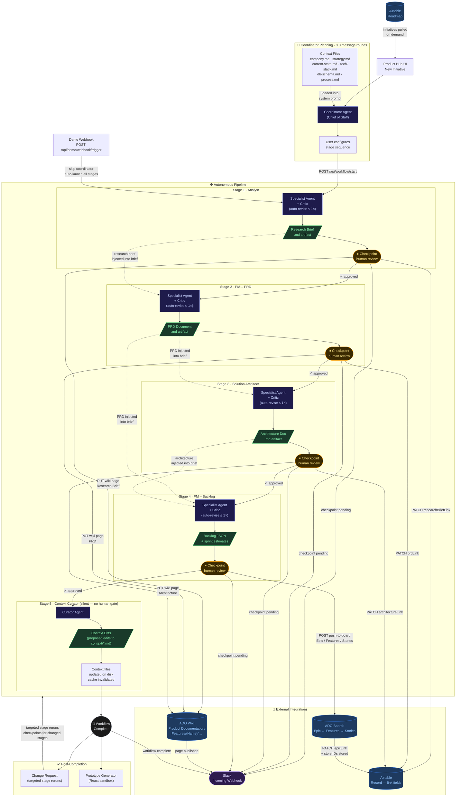
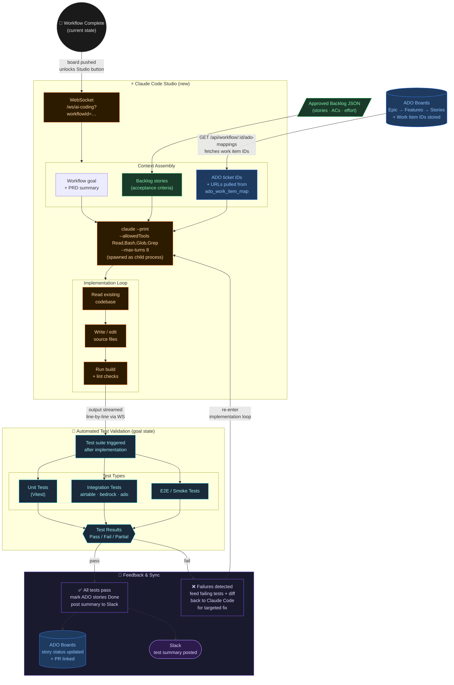

# Product Hub — System Flow Diagrams

## 1 · Current State: Full Pipeline with Integrations

---

## 2 · Goal State: Adding Claude Code + Automated Testing

The additions below extend the post-approval board push into a full code-generation and test-validation loop.

---

## 3 · Integration Reference

| Integration | Direction | Trigger | Data | API |
|---|---|---|---|---|
| **Airtable → Hub** | Pull | On demand / page load | Initiative titles, descriptions, status | `GET /api/initiatives` |
| **Hub → Airtable** | Push | Stage checkpoint approved | `researchBriefLink`, `prdLink`, `architectureLink`, `epicLink` | Airtable REST PATCH |
| **Hub → ADO Wiki** | Push | analyst / pm_prd / solution_architect approved | Page content under `Product Documentation/Features/{Name}/` | ADO Wiki REST PUT |
| **Hub → ADO Boards** | Push | Backlog approved (`push-to-board`) | Epic → Feature → Story hierarchy with effort, ACs | ADO Work Items REST POST |
| **ADO Boards → Hub** | Pull | On `push-to-board` | Work item IDs stored in `ado_work_item_map` for diff-sync | ADO Work Items REST GET |
| **Hub → Slack** | Push | Checkpoint pending · wiki published · workflow complete | Stage label, initiative title, wiki URL | Incoming Webhook POST |
| **Hub → Claude CLI** | Spawn | Code Studio opened (post board-push) | Goal, backlog stories, ADO ticket IDs via stdin | `claude --print` child process |
| **ADO Boards (goal)** | Push | Tests pass | Story status → Done, PR URL linked | ADO Work Items REST PATCH |
| **Slack (goal)** | Push | Test run complete | Pass/fail summary, story count | Incoming Webhook POST |
